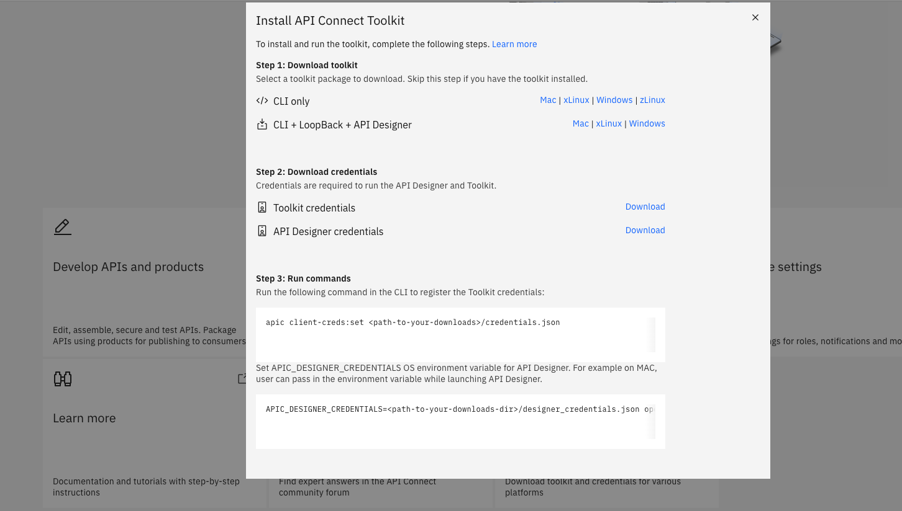
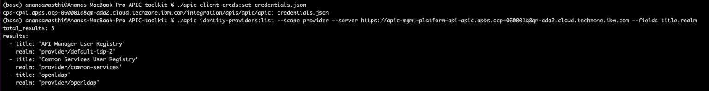

## Configure API Connect Developer toolkit

In this exercise you will configure API Connect Developer toolkit locally. 

### Step 1

Download the developer toolkit and credetial files for your Operating System (OS) either from Cloud Manager or API Manager

Click on 'Download toolkit'.

### Step 2

Extract the 'APIC Designer' and 'apic' CLI files in a directory. You can choose to keep 'credentials.json' and 'designer_credentials.json' files in same of different directory.

### Step 3

Create workspace directory on you machine

### Step 4

Run below commands to start the toolkit

`apic client-creds:set <path-to-your-downloads>/credentials.json`

Use the below command to determine the identity provider. 'mgmt_endpoint_url' for you environment will be provided by the instructor

`apic identity-providers:list --scope provider --server <mgmt_endpoint_url> --fields title,realm`

Set APIC_DESIGNER_CREDENTIALS OS environment variable for API Designer. For example on MAC, user can pass in the environment variable while launching API Designer.

`APIC_DESIGNER_CREDENTIALS=<path-to-your-downloads-dir>/designer_credentials.json open <path-to-downloaded-api-designer-app>/'API Designer.app'`

