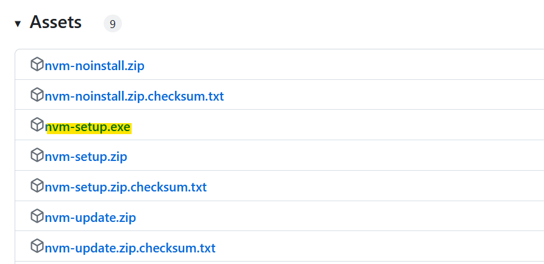
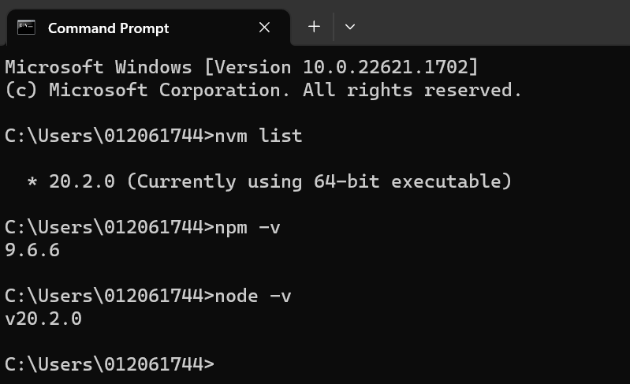

**Pre-requisite for Lab 9**

Windows
=======================================================================
If you already have node.js and npm installed in your system, skip to step 4 to verify the installation. 

1. Go to https://github.com/coreybutler/nvm-windows/releases and download the 
	node version manager (nvm) for windows under Assets section as shown below:
	
		
	
2. Click the downloaded .exe file to start the installation. 
	Windows usually requires administrative rights (to create symlinks). 
	Make sure you have administrative rights to proceed.

3. Go with the defaults in the installation wizard and finish the installation.

4. After the installation is successfully completed, open the command prompt and run the following 
	to verify the installation.
	
	`nvm list`
	
	`npm -v`
	
	`node -v`
	
	You should see the installed version as output as shown below (your version might be different).
	
			

Mac OS
===========================================================================================

1. Download and run the install script (install.sh) using curl or wget.

	`curl -o- https://raw.githubusercontent.com/nvm-sh/nvm/v0.39.3/install.sh | bash`

	`wget -qO- https://raw.githubusercontent.com/nvm-sh/nvm/v0.39.3/install.sh | bash`

2. Verify the installation. 

	`nvm list`
	
	`npm -v`
	
	`node -v`
	
	You should see the installed version as output
	
3. Refer https://github.com/nvm-sh/nvm#troubleshooting-on-macos for troubleshooting any issues.
