**APIC Workshop Lab 0 - Get Started**

In this lab, you will get started with Lab environment and create  
a Provider Organization.

In this tutorial, you will explore the following capabilities:

-   Access the Lab environment.

-   Access the Cloud Pak Console. 

- 	Access the API Connect Cloud Manager Console.

-   Configure an Email server for notifications.

-   Create a Provider Organization.

 APIC Workshop Series
====================================================================================================================================================================

The APIC Workshop Series is a hands-on workshop with lab exercises that
walk you through designing, publishing, and securing APIs. This workshop
is for API developers, architects, and line of business people who want
to create a successful API strategy. There are 9 labs and each is 30
minutes long. Make sure you choose enough time in your reservation to
get through all the labs! 

[NOTE: ]**[This demo environment contains a
full API Connect installation in Cloud Pak for Integration. The login
information to the APIC cluster will be sent in a separate email when
you reserve the instance. Use Google Chrome, Firefox or Microsoft Edge
to access the cluster using the credentials supplied. Make sure you
login using Common Services registry.]**

[Lab 0 : Get Started](https://github.com/mrdotan/apicv10/tree/main/instructions/Lab0)

[Lab 1 : Create and Secure an API to Proxy an Existing REST Web
service](https://github.com/mrdotan/apicv10/tree/main/instructions/Lab1)

[Lab 2 : The Developer Portal
Experience](https://github.com/mrdotan/apicv10/tree/main/instructions/Lab2)

[Lab 3 : Add OAuth Security to your
API](https://github.com/mrdotan/apicv10/tree/main/instructions/Lab3)

[Lab 4 : Use Lifecycle Controls to Version Your
API](https://github.com/mrdotan/apicv10/tree/main/instructions/Lab4)

[Lab 5: Advanced API
Assembly](https://github.com/mrdotan/apicv10/tree/main/instructions/Lab5)

[Lab 6: Working with API
Products](https://github.com/mrdotan/apicv10/tree/main/instructions/Lab6)

[Lab 7: The Consumer
Experience](https://github.com/mrdotan/apicv10/tree/main/instructions/Lab7)

[Lab 8: Create and test GraphQL Proxy
API](https://github.com/mrdotan/apicv10/tree/main/instructions/Lab8)

[Lab 9: Creating GraphQL API with StepZen](https://github.com/mrdotan/apicv10/tree/main/instructions/Lab9)

 Login to API Connect Cloud Manager
===========================================================================================

1. Open a browser window and login to the Cloud Pak Console with the url
   and credentials provided by the instructor.

	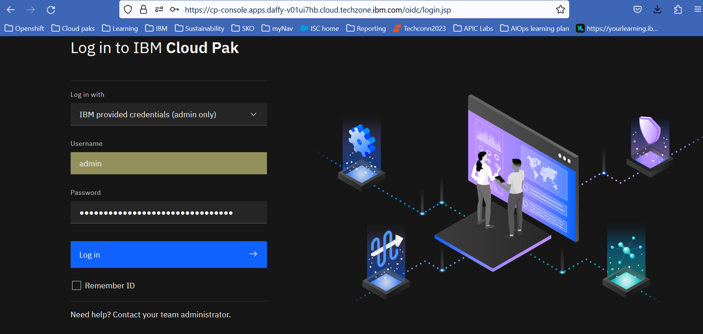
	
2. 	From the Home screen of the cloud pak console, click on the **Integration instances**.
	
	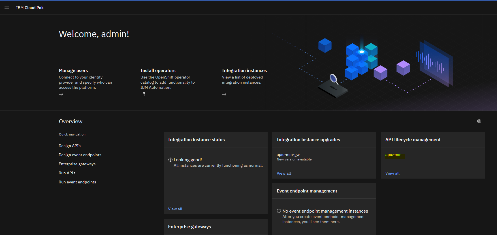
	
3. You will see instances of API Gateway, API Manager and API management Administration (Cloud Manager).
	Click on [[apic-min]] at API management administration to access the Cloud manager console.

	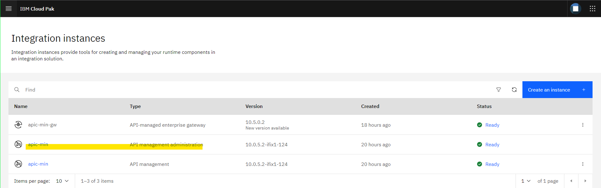
	
4. Log in to the Cloud Manager console using the **Common Services User Registry** user registry (if prompted).

	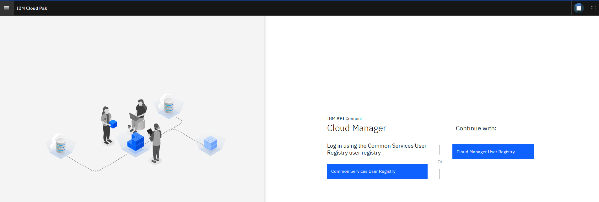
	
5. You will be able to see cloud manager console home screen as shown below.

	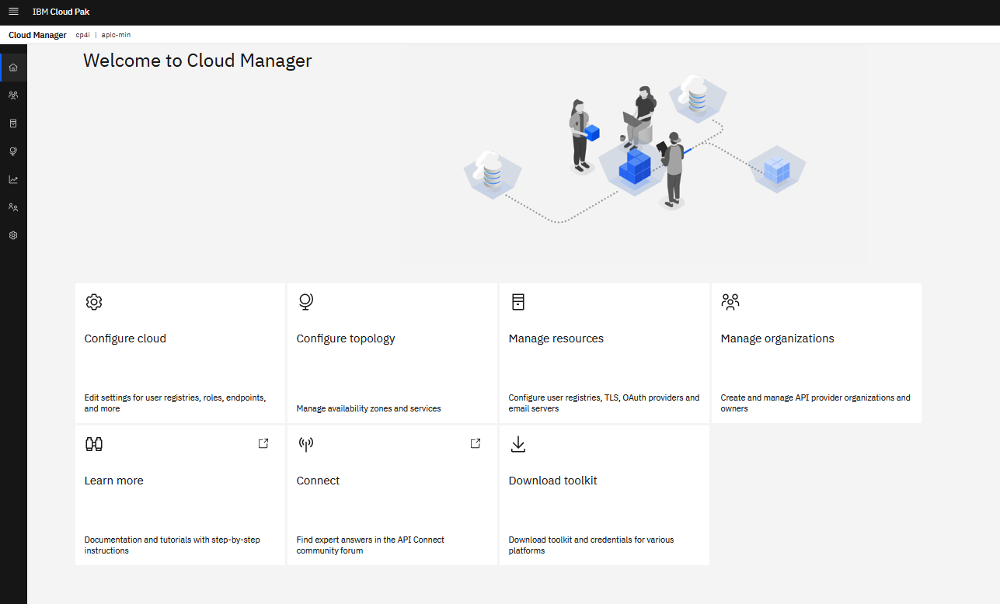
	
 Configure an Email Server
===========================================================================================
	
1. Click Resources icon in the left navigation menu or Manage Resources tile.

2. Cick Notifications and then Click Dummy mail server.

	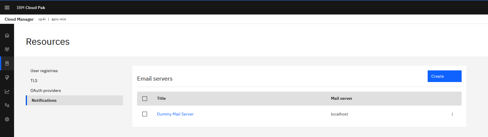
	
3. For the Address, enter `smtp-relay.sendinblue.com`
	Port, enter `587`
	Authenticate user, enter `apic.vest@gmail.com`
	Authenticate password will be provided by the instructor as shown below.
	
	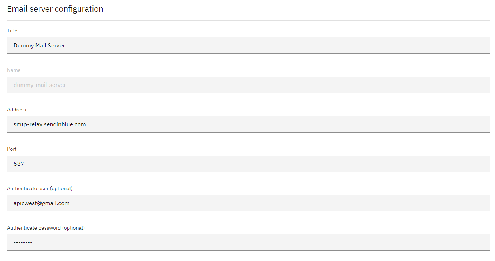	
	
4. Scroll down and click **Test email**.
   Enter your email address and click send email. 	
	
	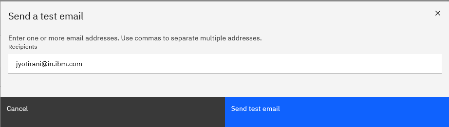	
	
	Make sure that the email is sent successfully and click **Save**.
	
 Configure sender email address
===========================================================================================

1. Click on admin in the top navigation and select My Account.

	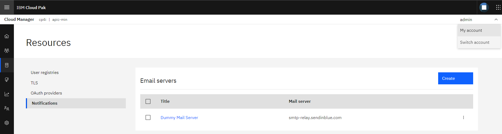	

2. Set the email address `apicvest@apiconnect.com` and Click **Save**.	

	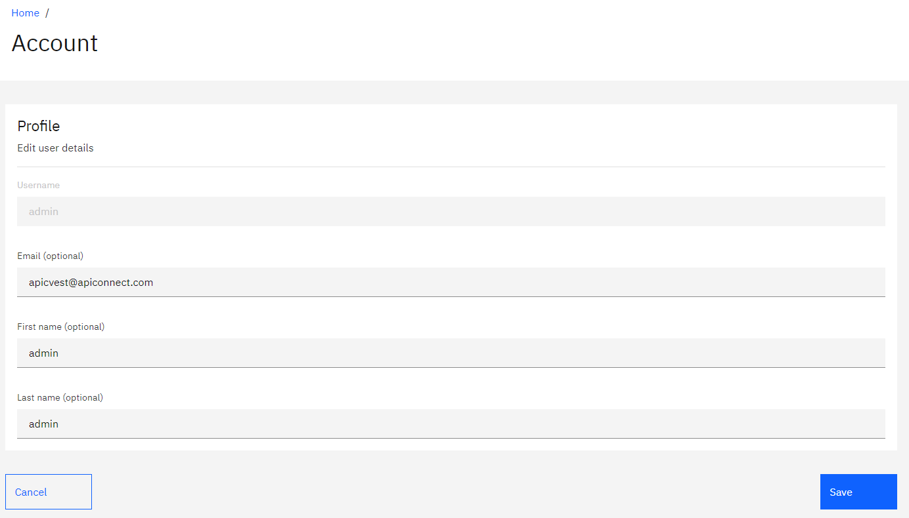	

 Create a Provider Organization
===========================================================================================

1. Click on Provider Organization icon in the left navigation menu OR 
   Click on Manage Organizations tile from the Cloud Manager console Home.
   
2. Click [[Add-\>Create organization]] to create the provider organization.
   
   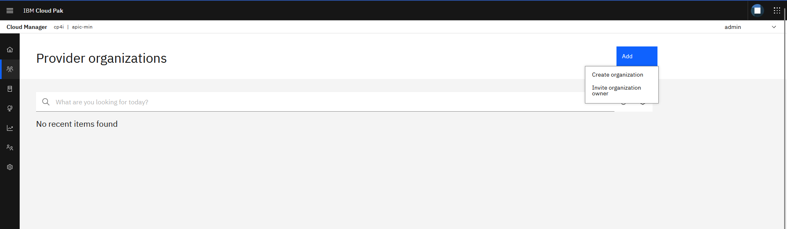

3. For the Title, enter `VEST`
   Select [[Common services user registry]] for user registry.
   Type `admin` for the existing username.
   Click **Create**
   
   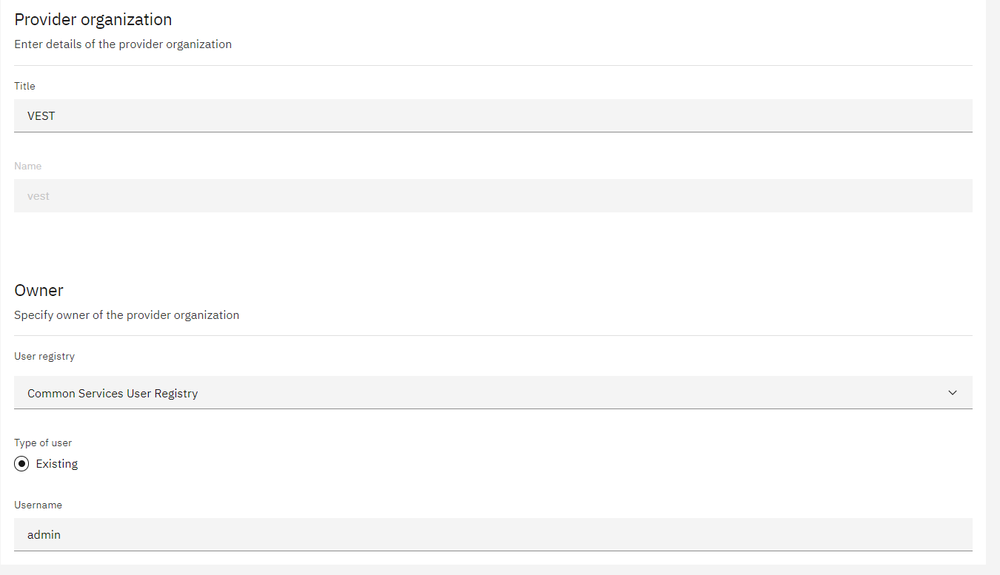   

7. Provider Organization should be created successfully as shown below.   

   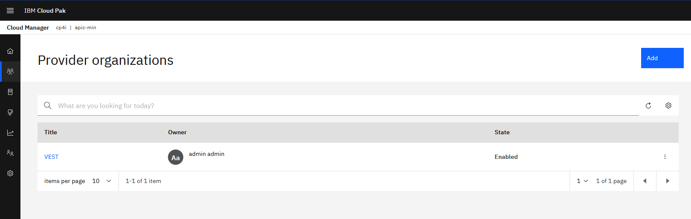      

 Summary
=============================================================

You completed the APIC Workshop Lab 0 - Get Started. 
Throughout the tutorial, you explored the key takeaways:

-   Access the Lab environment.

-   Access the Cloud Pak Console. 

- 	Access the API Connect Cloud Manager Console.

-   Configure an Email server for notifications.

-   Create a Provider Organization.

Continue the APIC Workshop! Go to [APIC Workshop Lab 1 - Create and Secure an API](https://github.com/mrdotan/apicv10/tree/main/instructions/Lab1) to
learn how to create and secure a new API using API Connect.
