**APIC VEST - Lab 9 -- Creating GraphQL API with StepZen**

In this lab, you will explore how you can quickly expose a REST backend as a GraphQL API. 

Using StepZen's CLI you can generate your GraphQL schema and resolvers for any backend data source (REST, Databases, GraphQL, Web3) with a few commands.

In this tutorial, you will do the following activities:

-   Sign-up for a free account in StepZen

-   Create GraphQL API for a REST backend

-   Deploy GraphQL API in StepZen

-   Test the GraphQL API

APIC VEST Series
=======================================================================================================================================================================================================================================================================================================

The APIC VEST AP Series is a hands-on workshop with lab exercises that
walk you through designing, publishing, and securing APIs. This workshop
is for API developers, architects, and line of business people who want
to create a successful API strategy. There are 9 labs and each is 30
minutes long. Make sure you choose enough time in your reservation to
get through all the labs! 

 

[NOTE: ]**[This demo environment contains a
full API Connect installation in Cloud Pak for Integration. The login
information to the APIC cluster will be sent in a separate email when
you reserve the instance. Use Google Chrome, Firefox or Microsoft Edge
to access the cluster using the credentials supplied. Make sure you
login using API Manager User Registry not Common Services
registry.]**

[Lab 1 : Create and Secure an API to Proxy an Existing REST Web
service](https://github.com/ibm-ecosystem-lab/APICv10/tree/main/instructions/Lab1)

[Lab 2 : The Developer Portal
Experience](https://github.com/ibm-ecosystem-lab/APICv10/tree/main/instructions/Lab2)

[Lab 3 : Add OAuth Security to your
API](https://github.com/ibm-ecosystem-lab/APICv10/tree/main/instructions/Lab3)

[Lab 4 : Use Lifecycle Controls to Version Your
API](https://github.com/ibm-ecosystem-lab/APICv10/tree/main/instructions/Lab4)

[Lab 5: Advanced API
Assembly](https://github.com/ibm-ecosystem-lab/APICv10/tree/main/instructions/Lab5)

[Lab 6: Working with API
Products](https://github.com/ibm-ecosystem-lab/APICv10/tree/main/instructions/Lab6)

[Lab 7: The Consumer
Experience](https://github.com/ibm-ecosystem-lab/APICv10/tree/main/instructions/Lab7)

[Lab 8: Create and test GraphQL Proxy
API](https://github.com/ibm-ecosystem-lab/APICv10/tree/main/instructions/Lab8)

[Lab 9: Creating GraphQL API with StepZen](https://github.com/ibm-ecosystem-lab/APICv10/tree/main/instructions/Lab9)

Prerequisites: Node.js and npm interface on your local machine. [Click here](https://docs.npmjs.com/downloading-and-installing-node-js-and-npm) for instructions.

 Create a GraphQL API with StepZen
=================================================================================

1.  Go to https://stepzen.com/developers and click on 'Start for Free' button in top right corner.

    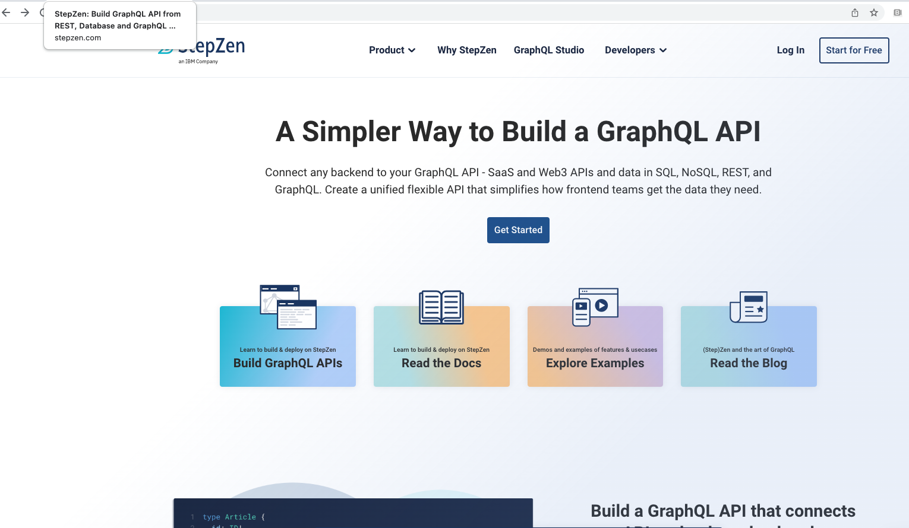

2.  You can sign-up with your GitHub account or with your email address.

    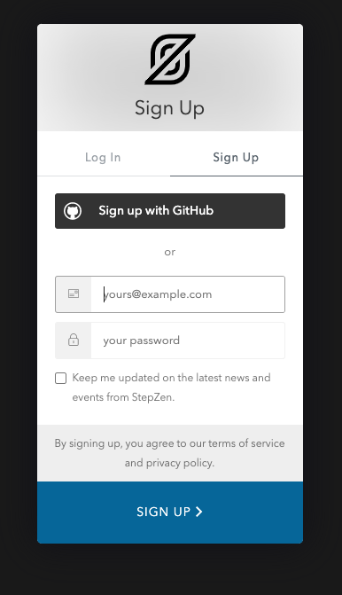
    
    Make sure to verify the account by clicking on the link received in email.

3.  After you successfully sign-up, you will by default have subscription to free plan that allows you to host two endpoints and 300k calls/month. Click on the 'key' icon in left hand side menu bar to look at your account information.

    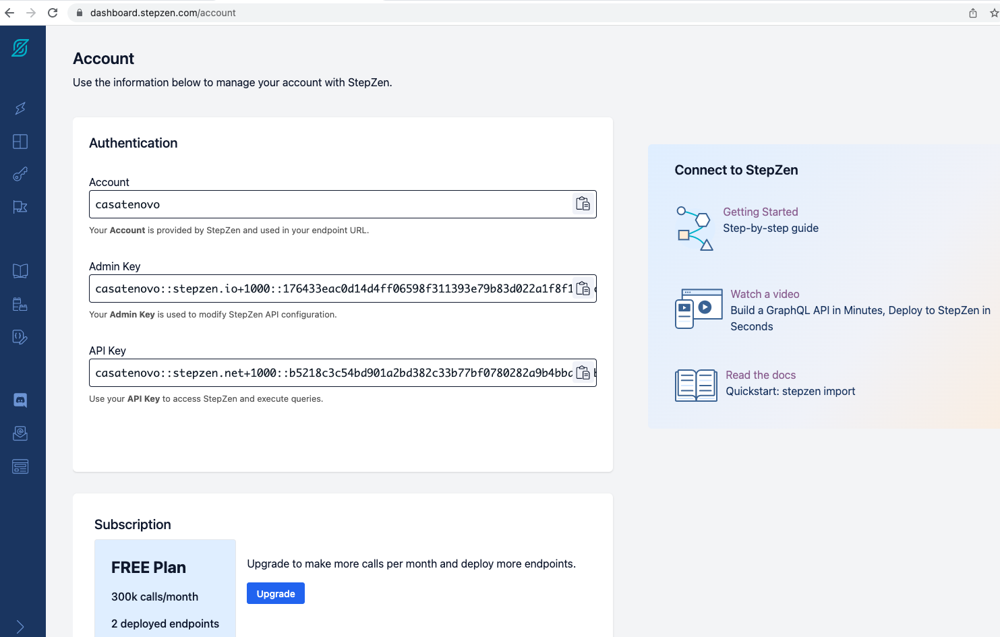
    
    The 'Admin Key' displayed here is used to authenticate to perform the administrative operations, like deployment of APIs in the account; while the 'API Key' is used to autneticate API calls at runtime.

4.  Click on the 'flag' icon in left hand side menu bar to go to getting-started page.

    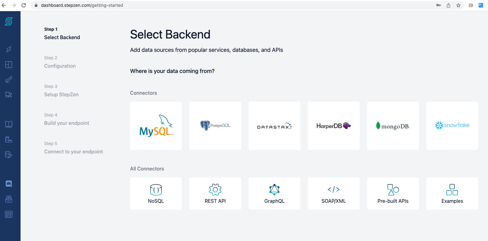

5.  Click on the 'REST API' under 'All Connectors'. You will see the steps required to setup your CLI for StepZen and connect to your StepZen account.
     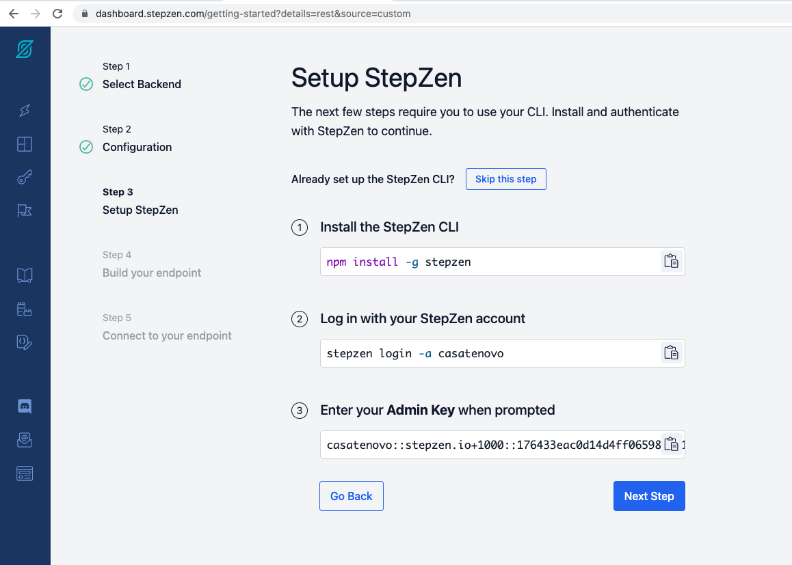
    
    Create a directory on your local machine and navigate to it using CLI:
    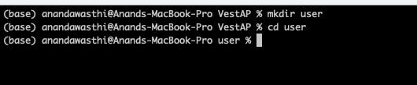
     
     Install the StepZen CLI
     
     `npm install -g stepzen`
     
     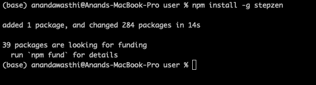
     
     Login with your StepZen account
     
     `stepzen login -a <Your account name>`
     
     Enter the admin key when prompted.
      

6.  We have hosted a REST backend that returns a list of user details.
    
    <http://usermgmt-http-ace.apps.ocp-060001q8qm-ada2.cloud.techzone.ibm.com/user/v1/showAll>
    
    Let us import this REST endpoint from the terminal using StepZen CLI.
    
    `stepzen import curl http://usermgmt-http-ace.apps.ocp-060001q8qm-ada2.cloud.techzone.ibm.com/user/v1/showAll`
    
    Supply the api endpoint name and enter.
    
    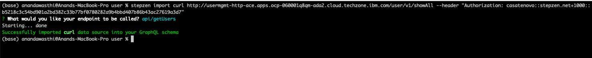
    
    Now type `stepzen start` in your terminal. This deploys the GraphQL API in StepZen and you can explore it from StepZen dashboard.
    
    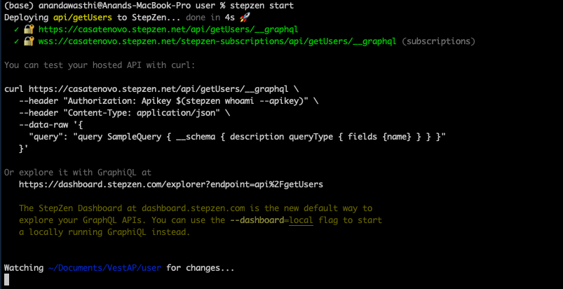

7.  Now go to StepZen dashboard `https://dashboard.stepzen.com/explorer`. You should see the GraphQL API endpoint there.

    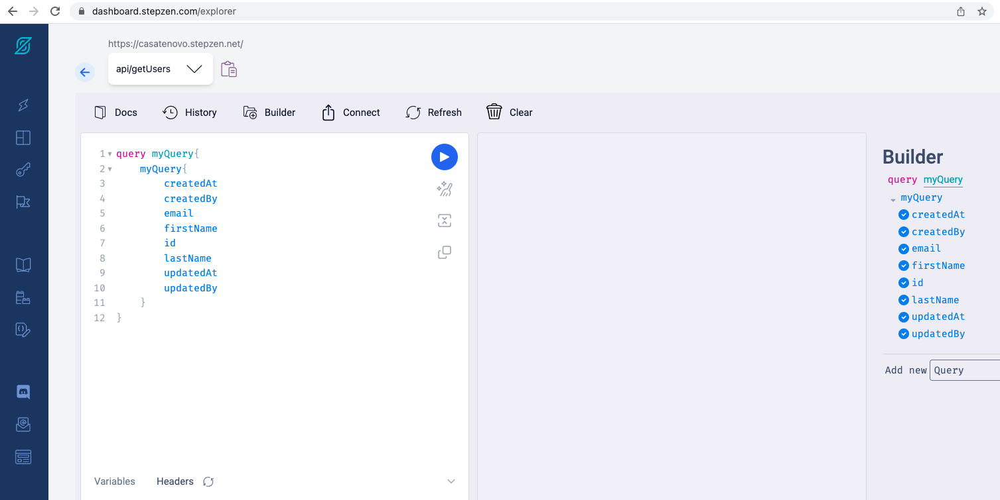

8.  From this playground you can test the hosted GraphQL API

   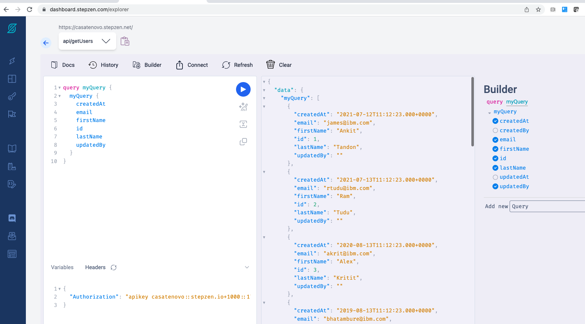

Summary
=================================================================================================================

Congratulations! You have successfully created a GraphQL API for a REST backend.

To learn more about StepZen, visit <https://stepzen.com/docs>

